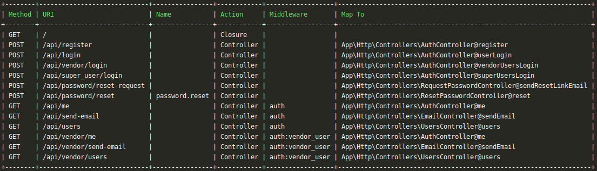

Lumen Route List
===================

This package will help to display all the registered route list like laravel.

#### This package inspired from [thedevsaddam/lumen-route-list](https://github.com/thedevsaddam/lumen-route-list)

----------

Installation
-------------
Via Composer

``` bash
$ composer require sayeed/lumen-route-list
```

Open bootstrap/app.php and add the line below

```php
$app->register(Sayeed\LumenRouteList\LumenRouteListProvider::class);
```

<hr/>

### **Uses**
1. Run `php artisan route:list` to display the route list
1. Inorder to filter routes use `php artisan route:list --method=searchKeyword --uri=searchKeyword`
1. To display in reverse order use `--reverse` or `-r`

Filtering example given below:
```bash
php artisan route:list --method=post
#The above example will filter all the routes with post method#
or
php artisan route:list --name=users
#The above example will filter all the routes which name contains *user* keyword#
or
php artisan route:list --name=users --method=get --uri=api/v1
#This above example will filter all the routes where name matches users, method matches get and uri matches api/v1
or to display in reverse order use
php artisan route:list --name=users -r
```




### **License**
The **lumen-route-list** is a open-source software licensed under the [MIT License](LICENSE.md).


## Credits

- [Md. Hasan Sayeed](https://github.com/jbhasan)

 For any questions, you can reach out to the author of this package, Md. Hasan Sayeed.

 Thank you for using it :)
